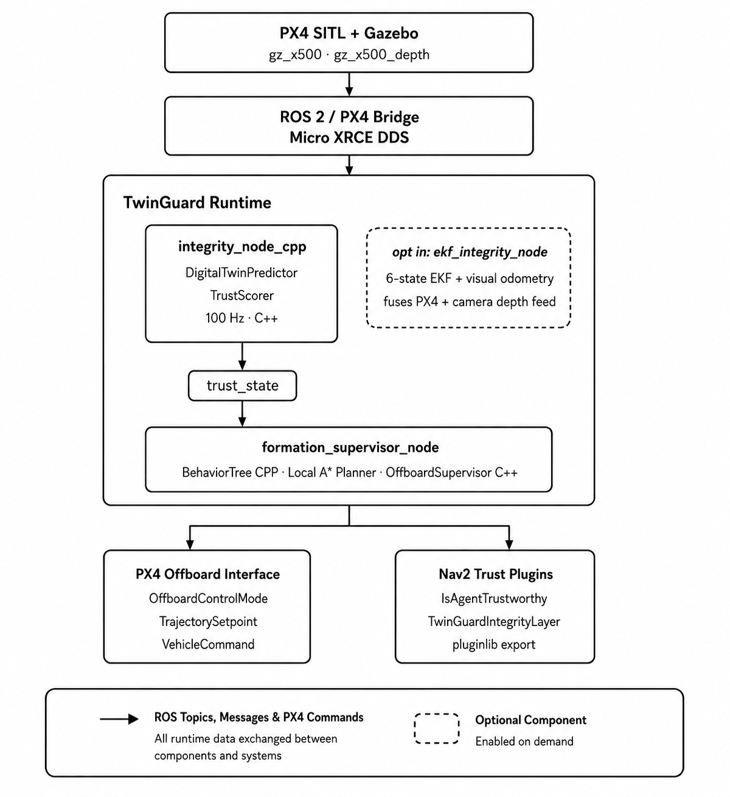

# TwinGuard

> **Autonomy assurance for UAV swarms — trust-gated control, behavior-tree supervision, and Nav2 integration built on ROS 2, PX4 SITL, and Gazebo.**

---

TwinGuard is a ROS 2 and PX4-based autonomy framework for making UAV swarms more resilient when localization becomes unreliable.

Most autonomy systems assume localization is trustworthy. When GPS is spoofed, communication degrades, or sensor measurements become inconsistent, planners and controllers often continue operating on corrupted state estimates or immediately fall back to an emergency failsafe.

TwinGuard explores a different idea: **integrity is a continuous signal, not a binary flag.**

Instead of deciding whether a UAV has "failed," TwinGuard continuously estimates how trustworthy each vehicle's state is and shares that information across planning, supervision, and control. A degraded UAV slows down, reroutes, or holds position proportionally to its confidence instead of failing catastrophically.

The goal is simple: **make localization integrity part of the autonomy pipeline rather than an isolated fault detector.**

---

# Control Pipeline

Every UAV continuously executes the following loop.

```text
PX4 VehicleOdometry
        │
        ▼
Digital Twin Prediction
        │
        ▼
Residual Computation
        │
        ▼
Continuous Trust Score
        │
        ▼
Authority Scaling
        │
        ├──────────────┐
        ▼              ▼
Behavior Tree       Nav2 Plugins
        │
        ▼
Offboard Supervisor
        │
        ▼
PX4 Offboard Commands
```

Rather than switching between "healthy" and "failed," trust changes continuously. Every subsystem reacts to the same trust estimate, allowing the vehicle to degrade gracefully whenever possible.

---

# How It Works

TwinGuard is built around one idea:

**Estimation, planning, and control should remain independent.**

The integrity node estimates trust.

The Behavior Tree decides what the UAV should try to do.

The Offboard Supervisor decides whether that command should actually reach PX4.

Keeping those responsibilities separate makes the system easier to reason about, easier to extend, and much harder for mission logic to bypass safety constraints.

For every control cycle:

- PX4 publishes the latest vehicle odometry.
- A lightweight digital twin predicts the expected vehicle state.
- The measured state is compared against that prediction to compute a residual.
- The residual is converted into a continuous trust score.
- Trust is mapped into an authority scale.
- The Behavior Tree selects the most appropriate mission objective.
- The Offboard Supervisor applies the final authority gate before publishing commands to PX4.
- Nav2 consumes the same trust information without requiring any changes to its planners or controllers.

---

# Architecture



TwinGuard is organized around one simple idea: estimation, planning, and control remain independent while sharing a common trust interface. The integrity node estimates trust from PX4 odometry, the Behavior Tree selects mission intent, and the Offboard Supervisor applies the final authority gate before commands reach PX4. An optional EKF pipeline can replace the default integrity estimator without changing downstream components because both publish the same trust_state interface.

The architecture intentionally separates **decision making** from **command execution**.

The Behavior Tree determines **what mission objective should be followed**.

The Offboard Supervisor determines **whether that command should actually be sent to PX4** based on the current integrity estimate.

That separation means safety enforcement remains independent of mission logic.

---

# Optional EKF Pipeline

The default integrity node uses a lightweight constant-velocity digital twin to generate prediction residuals.

TwinGuard also includes an optional EKF-based integrity pipeline that fuses:

- PX4 position odometry
- Sparse optical-flow visual odometry
- Depth-scaled motion estimates

Visual odometry quality directly influences EKF measurement noise instead of simply accepting or rejecting measurements. Low-quality observations still contribute to the estimate but receive proportionally less influence.

Both estimators publish the exact same `trust_state` interface, so switching estimators requires no downstream changes.

---

# Core Packages

| Package | Language | Responsibility |
|----------|----------|----------------|
| `twinguard_swarm_integrity_cpp` | C++ | Digital twin prediction, integrity scoring, trust management, formation supervision, authority-gated offboard control |
| `twinguard_swarm_planning_cpp` | C++ | BehaviorTree.CPP mission supervision, obstacle checking, local 3D A* planner |
| `twinguard_swarm_estimation_cpp` | C++ | Sparse optical-flow visual odometry, 6-state EKF, EKF integrity pipeline |
| `twinguard_swarm_nav2_cpp` | C++ | Nav2 BT condition plugin and localization-aware costmap layer |
| `twinguard_dataset_replay` | Python | Dataset-driven degradation replay into live PX4 odometry |
| `twinguard_swarm_bringup` | Python | Launch configurations for integrity, replay, EKF, single-UAV, and multi-UAV experiments |

# Engineering Trade-offs

### Continuous trust instead of binary fault detection

TwinGuard intentionally avoids classifying vehicles as simply *healthy* or *failed*.

Residuals are converted into a continuous trust score that gradually reduces vehicle authority as localization quality deteriorates. Mild degradation results in slower motion and reduced authority, while severe degradation can trigger mission-specific actions such as holding position or rerouting.

The objective is to respond proportionally instead of catastrophically.

---

### Mission planning and safety remain independent

The Behavior Tree never publishes PX4 commands directly.

Its only responsibility is deciding **what the UAV should try to do**.

The Offboard Supervisor always performs the final authority check before commands reach PX4. Even if the planner selects a nominal mission, the supervisor can still reduce velocity or prevent unsafe commands from being executed.

Keeping these responsibilities separate makes the control pipeline easier to reason about and prevents mission logic from bypassing integrity constraints.

---

### Lightweight digital twin by design

The default digital twin is intentionally simple.

Rather than using a computationally expensive dynamics model, it propagates the vehicle state using a constant-velocity prediction that continuously corrects itself using incoming PX4 odometry.

The goal is not perfect prediction. The goal is stable residual generation suitable for real-time integrity estimation.

---

### One trust interface across the autonomy stack

Every major subsystem consumes the same message.

```
geometry_msgs/PointStamped

point.x → trust
point.y → residual
point.z → authority_scale
```

The Offboard Supervisor, Behavior Tree, and Nav2 plugins all read this interface identically.

Because of that, the default integrity node and the EKF integrity node can be swapped without changing downstream components.

---

### Nav2 integration is additive

TwinGuard extends Nav2 instead of replacing it.

A custom Behavior Tree condition exposes trust information to navigation logic, while a localization-aware costmap layer represents uncertainty around the robot's own estimated position rather than external obstacles.

Existing planners, controllers, and recovery behaviors remain untouched.

---

### Dataset-driven validation

Instead of replaying prerecorded trajectories, TwinGuard injects controlled localization degradation into live PX4 odometry using real dataset statistics.

Dataset error magnitude, quality, and anomaly information are converted into realistic perturbations before entering the integrity pipeline, allowing the remainder of the autonomy stack to operate exactly as it would during normal flight.

---

### Modular deployment

The autonomy stack is intentionally separated into independent services.

- PX4 SITL
- ROS 2 autonomy core
- Nav2
- Experiment logging

A Fast DDS Discovery Server replaces multicast discovery, allowing services to communicate reliably across Docker bridge networks while keeping safety-critical autonomy isolated from supporting infrastructure.

---

# Status

| Component | Status |
|------------|:------:|
| C++ integrity scoring + trust manager | ✅ |
| Trust-gated offboard supervisor | ✅ |
| BehaviorTree.CPP mission supervision | ✅ |
| Local 3D A* rerouting | ✅ |
| Real dataset replay validation | ✅ |
| Sparse optical-flow visual odometry | ✅ |
| 6-state EKF integrity pipeline | ✅ |
| Nav2 BT condition plugin | ✅ |
| Nav2 localization-aware costmap layer | ✅ |
| Docker microservice deployment | ✅ |
| Fast DDS Discovery Server | ✅ |
| Full `colcon` build + Ubuntu/Jazzy validation | ⏳ Pending |
| Multi-agent trajectory conflict monitoring | ⏳ Planned |

---

# Simulation Fidelity

TwinGuard's integrity thresholds are currently calibrated using Gazebo.

The companion project **sim-val** measures the sensing fidelity gap between Gazebo ray-casting and NVIDIA Isaac Sim RTX under identical scenarios, then evaluates how that difference propagates into TwinGuard's EKF trust estimates.

The long-term goal is simulator-specific integrity calibration instead of manually tuned thresholds.

---

# Documentation

- Architecture
- Topic Contract
- Quick Start
- Deployment Guide
- Dataset Replay
- EKF Integrity Pipeline

---

> **TwinGuard demonstrates how localization integrity can become a shared decision-making signal across an entire autonomy stack, allowing UAVs to respond proportionally to degraded sensing instead of treating every fault as an immediate failure.**
