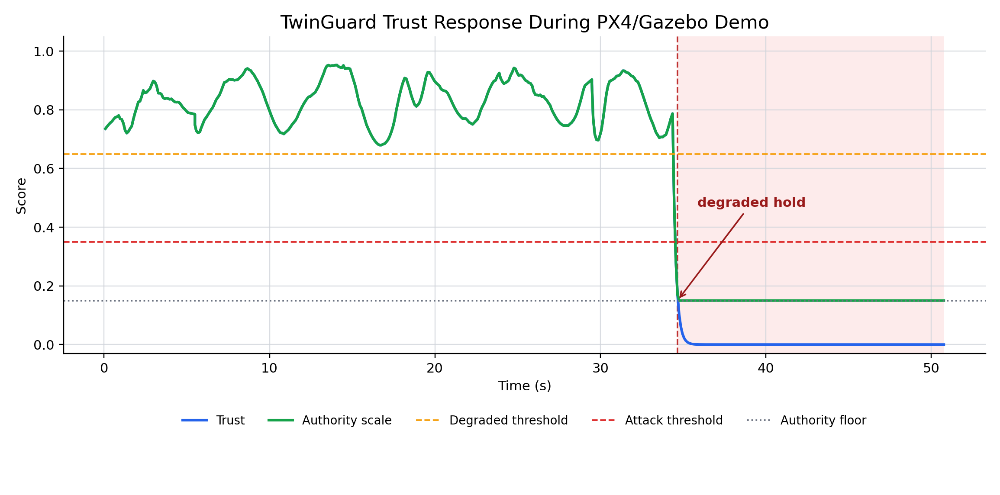
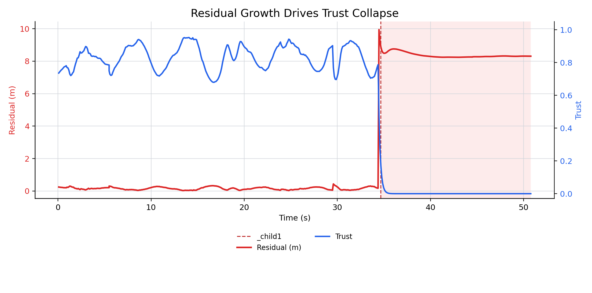

# TwinGuard

> **Trust-aware autonomy framework for UAVs built on ROS 2, PX4 SITL, and Gazebo. TwinGuard continuously estimates localization integrity and adapts planning, supervision, and offboard control before degraded state estimates propagate through the autonomy stack.**


---

## 🎥 Demo

<p align="center">
<b>End-to-end PX4 SITL demonstration showing nominal operation, localization degradation, trust-aware supervision, and recovery.</b>
<br><br>
          
</p>

---

## Architecture

<p align="center">

</p>

TwinGuard separates **estimation**, **planning**, and **control** through a common trust interface.
Localization confidence is estimated once and consumed throughout the autonomy pipeline rather than embedding fault handling inside every controller.

---

## Why TwinGuard?

Most UAV autonomy stacks assume localization is always trustworthy.

When GPS is spoofed, communication quality degrades, or state estimation becomes unreliable, planners continue making decisions using corrupted state estimates — or immediately trigger a failsafe.

TwinGuard follows a different philosophy.

Instead of treating integrity as a binary fault, **TwinGuard models localization confidence as a continuous runtime signal.**

Residual-based trust estimation continuously adjusts the amount of authority given to autonomy components, allowing the vehicle to:

- continue normal operation,
- slow down,
- reroute,
- or hold position

depending on confidence rather than a single threshold crossing.

---

## System Pipeline

```text
PX4 VehicleOdometry
          │
          ▼
Digital Twin Prediction
          │
Residual Computation
          │
Continuous Trust Estimation
          │
Trust State
          │
 ┌────────┴─────────┐
 │                   │
 ▼                   ▼
BehaviorTree.CPP    Nav2 Plugins
 │                   │
 └────────┬──────────┘
          ▼
Offboard Supervisor
          │
Authority Scaling
          │
TrajectorySetpoint
          │
          ▼
         PX4
```


---

## Validation

TwinGuard is validated using PX4 SITL and Gazebo by injecting localization degradation into the autonomy pipeline and observing how trust-aware supervision adapts vehicle authority.

### Trust-aware supervisory response

<p align="center">

</p>

During nominal operation, trust remains high and the supervisor allows full authority. When localization integrity degrades, trust drops rapidly, authority is reduced to a configurable floor, and the supervisor transitions into **degraded-hold** mode to prevent unsafe control commands.

---

### Residual-driven trust collapse

<p align="center">

</p>

Localization residuals remain low during normal operation. When degraded localization is introduced, residuals increase sharply, causing the trust estimator to reduce confidence before corrupted state estimates propagate through planning and control.

---
## Packages

| Package | Responsibility |
|---|---|
| `twinguard_swarm_integrity_cpp` | Digital twin prediction, trust estimation, authority scaling, formation supervision, PX4 offboard interface |
| `twinguard_swarm_planning_cpp` | BehaviorTree.CPP mission supervision and local A* planning |
| `twinguard_swarm_estimation_cpp` | Visual odometry, 6-state Kalman filter, integrity estimation |
| `twinguard_swarm_nav2_cpp` | Nav2 Behavior Tree condition and localization-aware costmap |
| `twinguard_dataset_replay` | Dataset-driven localization degradation replay |
| `twinguard_swarm_bringup` | Launch files and experiment orchestration |

---

## Engineering Highlights

- Modular ROS 2 package architecture
- PX4 SITL + Gazebo Harmonic integration
- Continuous trust estimation instead of binary fault detection
- Trust-aware offboard supervision
- BehaviorTree.CPP mission supervision
- Nav2 localization-aware extensions
- Dataset replay for repeatable degradation scenarios
- 6-state Kalman-based integrity estimation
- Docker-based development environment
- Fast DDS deployment support

---

## Validation

TwinGuard has been validated using a reproducible ROS 2 workflow.

### Build & CI

- ✅ Ubuntu 24.04
- ✅ ROS 2 Jazzy
- ✅ Full colcon build
- ✅ GitHub Actions CI
- ✅ Automated package testing

### Unit Testing

GoogleTest coverage includes:

- TrustScorer
- Kalman Estimator
- A* Planner

### Integration Testing

ROS 2 launch testing validates the integrity-supervisor pipeline:

```text
VehicleOdometry
        ↓
Integrity Node
        ↓
Trust State
        ↓
Offboard Supervisor
        ↓
Authority-scaled Commands
```

---

## Repository Status

| Component | Status |
|---|---|
| Trust estimation | ✅ |
| Offboard supervisor | ✅ |
| BehaviorTree mission supervision | ✅ |
| A* planner | ✅ |
| Dataset replay | ✅ |
| Visual odometry | ✅ |
| Kalman estimator | ✅ |
| Nav2 plugins | ✅ |
| Docker environment | ✅ |
| GitHub Actions CI | ✅ |
| GoogleTest suite | ✅ |
| ROS 2 integration tests | ✅ |
| PX4 SITL demonstration | ✅ |
| Multi-UAV conflict monitoring | 🚧 |

---

## Documentation

- [Architecture](docs/architecture.md)
- [Topic Contract](docs/topic-contract.md)
- [Quickstart](docs/quickstart.md)
- [Deployment](docs/deployment.md)
- [Dataset Replay](docs/dataset-replay.md)

---

## Companion Project

The companion project **SimBEL** evaluates simulator fidelity across Gazebo and NVIDIA Isaac Sim and studies how simulation fidelity affects TwinGuard's localization integrity estimation.

TwinGuard treats localization integrity as a shared runtime signal, allowing estimation, planning, and control to adapt together rather than reacting independently to degraded localization.
